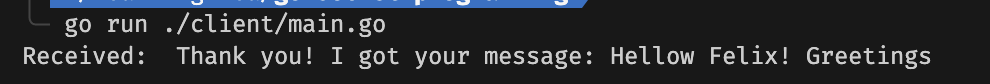
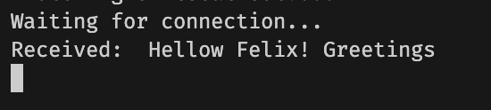

## Experiment Project - Socket Programming in Go

Experiment project for create application with **socket** impementation. Sockets allow communication between two different processes on the same or different machines.

A socket is one endpoint of a two way communication link between two programs running on the network. The socket mechanism provides a means of inter-process communication (IPC) by establishing named contact points between which the communication take place.

---


How to test, run in terminal command:
```
go run ./server/main.go 
```
Then run:
```
go run ./client/main.go
```
---
After you run client script, it will show like below:



And at server, you will got message like below:



---

If you want more information just hit me up. :)

Reference:

- https://www.developer.com/languages/intro-socket-programming-go/
- https://www.geeksforgeeks.org/socket-in-computer-network/
